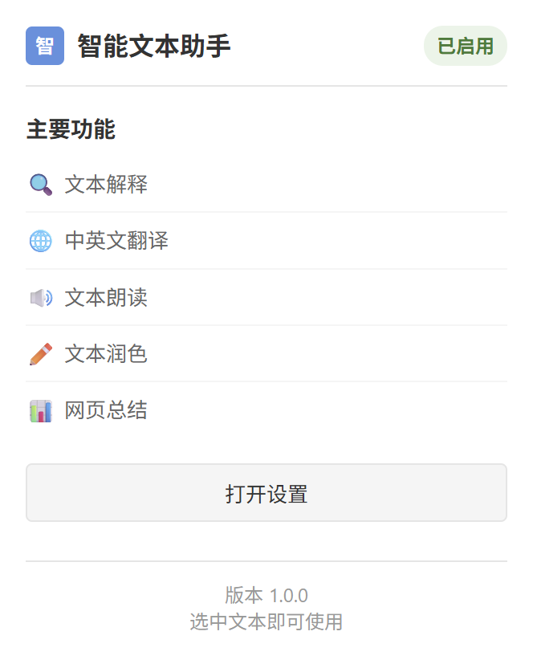

# 智能文本助手 Chrome 插件

## 支持功能

- [x] 文本解释
- [x] 中英文翻译
- [x] 文本朗读
- [x] 文本润色
- [x] 网页内容总结为思维脑图

## 使用方法

1. 下载代码
2. 在 Chrome 浏览器中打开扩展程序管理页面
3. 打开开发者模式
4. 加载已解压的扩展程序
5. 在浏览器中打开任意网页，点击插件图标即可使用

## 效果预览

